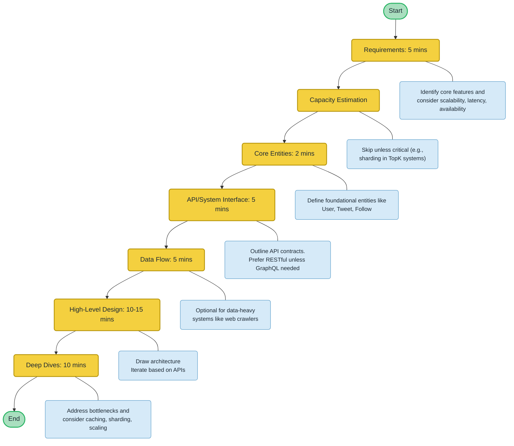

# Recommended Structure:

1. Requirements (5 mins):

- Functional Requirements: Identify core features (e.g., "Users should be able to post tweets"). Prioritize 2-3 key features.

- Non-Functional Requirements: Focus on system qualities like scalability, latency, and availability. Quantify where possible (e.g., "render feeds in under 200ms").

2. Capacity Estimation: Skip unnecessary calculations unless they directly impact the design (e.g., sharding in a TopK system).

3. Core Entities (2 mins): Identify key entities (e.g., User, Tweet, Follow) to define the system's foundation.

4. API/System Interface (5 mins): Define the contract between the system and users. Prefer RESTful APIs unless GraphQL is necessary.

5. [Optional] Data Flow (5 mins): Describe high-level processes for data-heavy systems (e.g., web crawlers).

6. High-Level Design (10-15 mins): Draw the system architecture, focusing on core components (e.g., servers, databases). Keep it simple and iterate based on API endpoints.

7. Deep Dives (10 mins): Address non-functional requirements, edge cases, and bottlenecks. Proactively improve the design (e.g., scaling, caching, database sharding).

# Tips:

1. Avoid overcomplicating the design early on.

2. Communicate clearly with the interviewer, explaining your thought process and data flow.

3. Focus on relevant fields in the data model, not every detail.

4. Balance proactive discussion with listening to the interviewer’s probes.

# Example: Twitter System Design

1. Functional Requirements: Post tweets, follow users, view feeds.

2. Non-Functional Requirements: High availability, low latency (<200ms), scalability to 100M+ DAUs.

3. Core Entities: User, Tweet, Follow.

4. API Endpoints: POST /v1/tweet, GET /v1/feed, etc.

5. Deep Dives: Discuss fanout-on-read vs. fanout-on-write, caching, and horizontal scaling.